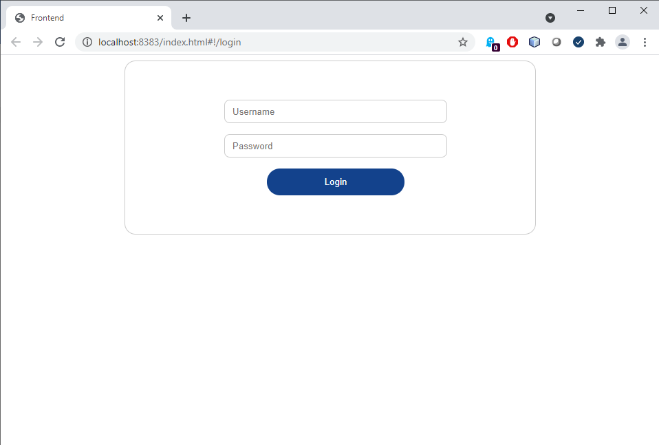
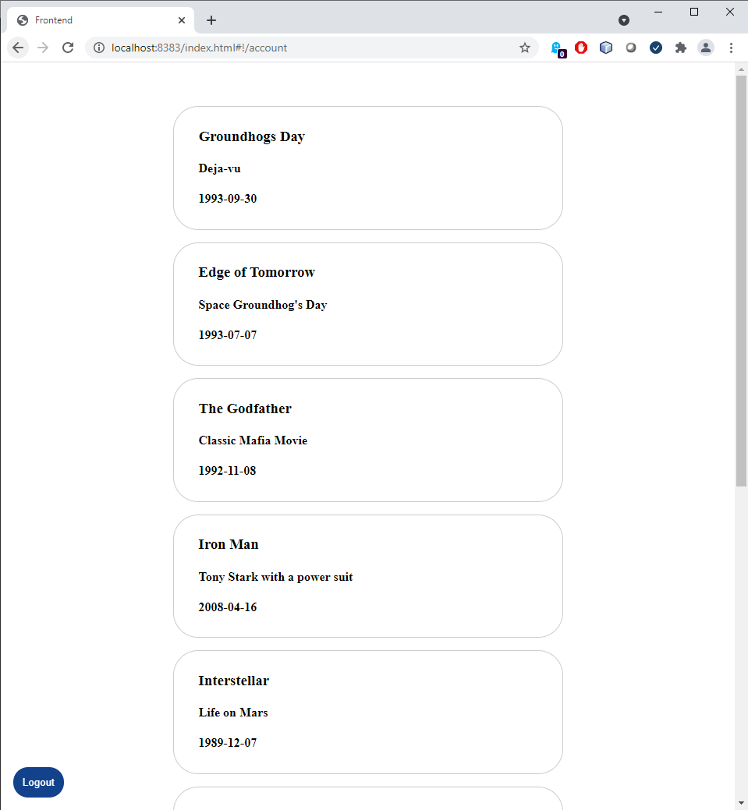

# Frontend Test - Task Description
## Introduction
Thank you for applying to [Company Name]! We're really excited to meet you in the coming
weeks. To help us get to know you as a developer, we would like for you to complete a simple
web application project. We understand that applying for jobs can be very time-consuming so please
just complete as much as you are able to prior to the interview - don't worry if it's not 100% 
perfect! We'll use this project as a jump-off point to get to know your development and problem-solving
methods and strategies.

## Project Description
Your task is to build a simple single-page application (SPA) in the [frontend](frontend) directory
using the simple json-server in the [backend](backend) directory. At [Company Name] we use [Framework],
but you may use the framework of your choice. We trust that if you're adept at one of the many
SPA JS frameworks that you'll be able to easily learn [Framework]. You may use any other additional
libraries of your choice and may add embellishments on top of our base and bonus requirements to show
off your frontend prowess!

### Project Setup
As you can see, the ["frontend"](frontend) repository has been left relatively empty for you.
You may structure this repository as you see fit and as guided by your choice of libraries. Our only
requirement is that the project must be executed/served by the `npm run-script serve` command so please
alias that entry of the `package.json` file to whatever run command you are using. Also, for the sake
of simplicity, please make the frontend accessible from `localhost:3000`.

The backend for this test can be found in the [backend](backend) directory. Please refer to the
[backend's README](backend/README.md) for details on how to run it.

### Login Page
This should be the default route for unauthenticated users. The login page should accept an email (string, 
text input) and a password (string, password input) to authenticate users. Please refer to
the documentation for [json-server-auth](https://github.com/jeremyben/json-server-auth) for details
on the JWT-based authentication flow you should use.

Here's an example of what the login page could look like:

### Logout Function
A button should be included on each page to log users out of the application. Since json-server-auth
does not include a `/logout` route, this functionality can be accomplished by deleting the cached
bearer token and redirecting the user to the main login page.

### Movies Page
This should be the default route for authenticated users. It should list the collection of movies
found in [db.json](backend/db.json). The list can only be reached by authenticated users with
a valid bearer token at `localhost:8000/movies`.

Each movie object consists of an "id", "name", "description", "date", and "userId" to indicate the 
user that created the entry. Display these properties as you see fit.

Here's an example of what the movies page could look like:

### Movie Details Page
Each entry of the Movies page's list should have a link to view the details of that movie.
A single movie entry can be retrieved from the backend using `localhost:8000/movies/:id`. Display
the details as you see fit and include a way to return to the main movies list.

### Create a Movie (Bonus!)
As a bonus feature, you can create a page with a form to create a new movie in the database. New
movies can be created by making a `POST` request to the `localhost:8000/movies` endpoint.

### Edit a Movie (Bonus!)
As a bonus feature, you can create a page with a form to edit an existing movie in the database. 
Movies can be edited by making a `PATCH` request to the `localhost:8000/movies/:id` endpoint.

### Delete a Movie (Bonus!)
As a bonus feature, you can create a link to delete an existing movie in the database.
Movies can be deleted by making a `DELETE` request to the `localhost:8000/movies/:id` endpoint.

## References
- [backend README.md](/backend/README.md)
- [json-server](https://github.com/typicode/json-server)
- [json-server-auth](https://github.com/jeremyben/json-server-auth)
- [Mithril](https://Mithriljs.org)
- [Labyrinth Technologies](https://www.labyrinth-tech.com/)
- [Interviewer Email - Ron Pittwood](mailto:r.pittwood@labyrinth-tech.com)
